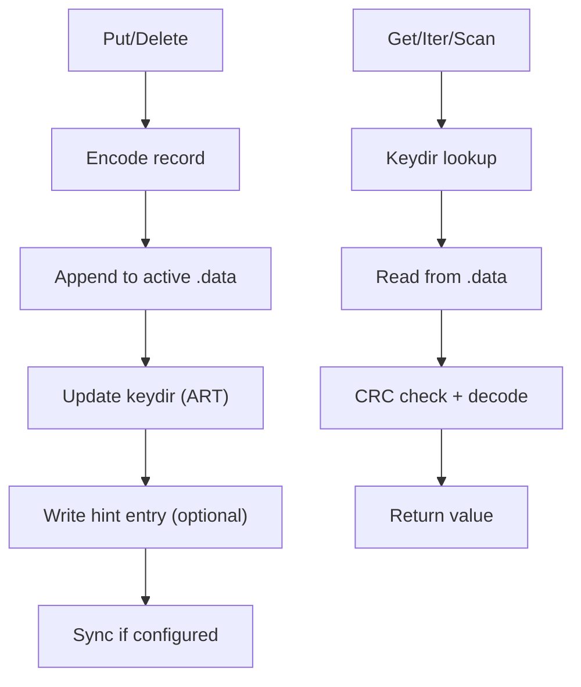
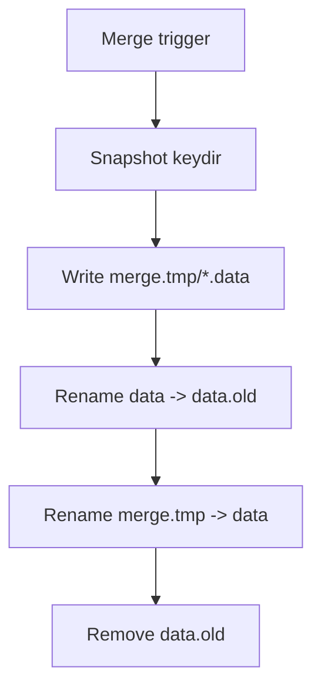

# Architecture

Bitgask is a Bitcask-style log-structured key-value store. It appends records to immutable data files and maintains an in-memory keydir (adaptive radix tree) that points to the latest record for each key.

## Components
- Data files: append-only `.data` files for all writes.
- Hint files: `.hint` files that accelerate startup by storing keydir entries.
- Keydir: in-memory map from key to record metadata.
- Merge: background compaction that rewrites live records.

## Write Path
1. Encode record with CRC and optional compression.
2. Append record to the active data file.
3. Update the in-memory keydir with the latest record position.
4. Append a hint entry when hints are enabled.
5. Fsync the data file if configured.

## Read Path
1. Look up the key in the keydir.
2. Read the record at the stored file offset.
3. Validate CRC and decode.
4. Return the value (decompressing if needed).

## Startup Flow
- If hint files are enabled, Bitgask loads and validates hints.
- If hints are missing or invalid, it scans data files and rebuilds the keydir.
- `ValidateOnOpen` always scans data files, skipping hints.

## Merge Flow
1. Snapshot the keydir.
2. Write all live records to `merge.tmp`.
3. Rename `data` to `data.old`.
4. Rename `merge.tmp` to `data`.
5. Remove `data.old` and reopen active files.

## Concurrency Model
- Reads are concurrent.
- Writes are serialized.
- `Reopen` and `Close` block other operations while rebuilding state.
- Streaming iterators run under a read lock.

## Data Flow Diagram

## Merge Diagram

